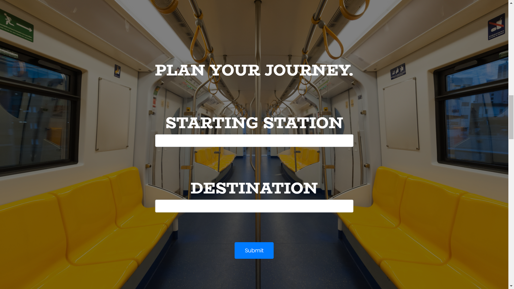
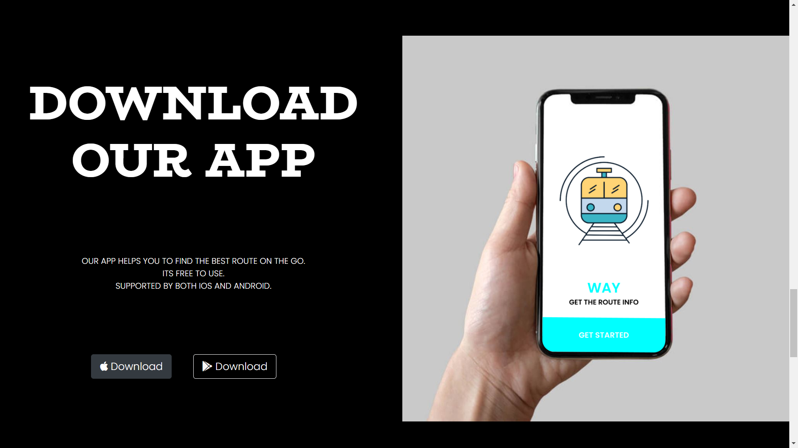

<p align="center">
  Website to find the optimal route for your metro journey
</p>
<p align="center">
Show some love 💜 and Star ⭐️ the Repository to support the project.
</p>

## : Screenshots

<p align="center">
  
</p>

<p align="center">
  
</p>

<p align="center">
  
</p>

<p align="center">
  
</p>

<p align="center">
  
</p>

## :rocket: Get Up and Running 

1. **Go to your terminal and execute this command**
    ```
    git clone https://github.com/ritz1804/Way-Website.git
    ```

2. **Run this command in side the project folder to install node modules**
    ```
    npm install
    ```
  
3. **Execute this command in your terminal inside the project folder**
    ```
    node index.js
    ```

4. **Open the source code and start editing!**

## :question: Queries / Bugs
If you got any queries or found a bug, open an [Issue](https://github.com/ritz1804/Way-Website/issues/new) 

## :purple_heart: Thanks
